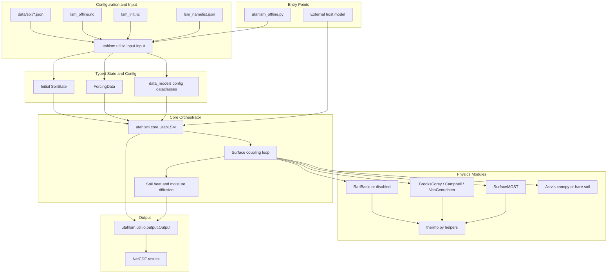
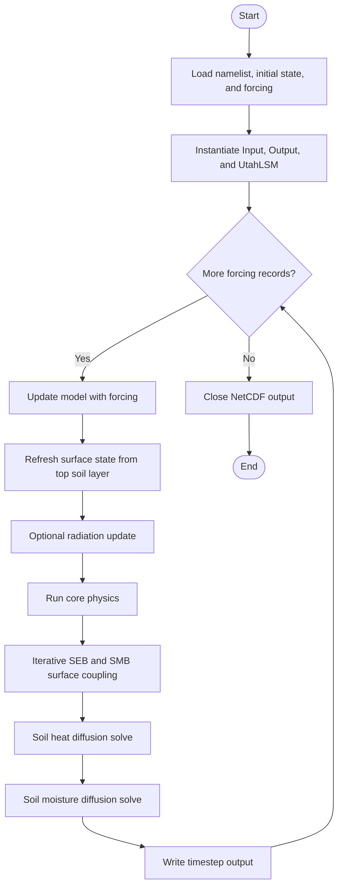

# Architecture

UtahLSM separates input loading, timestep orchestration, physics parameterizations, and NetCDF output. The main `UtahLSM` class coordinates those pieces while concrete physics modules are selected from the namelist.

## High-Level Structure

## Timestep Flow

## Model Selection from the Namelist

| Component | Selector | Current implementations |
| --- | --- | --- |
| Surface layer | `surface.model` | `1 = SurfaceMOST` |
| Soil hydrology | `soil.model` | `1 = BrooksCorey`, `2 = Campbell`, `3 = VanGenuchten` |
| Radiation | `radiation.model` | `0 = disabled`, `1 = RadBasic` |
| Canopy | `canopy.model` | `"none"`, `"jarvis"` |

## Design Notes

- `Input` is responsible for schema validation, NetCDF loading, and assembling typed dataclasses before the core model runs.
- `UtahLSM` owns the mutable runtime state and invokes the physics modules in the correct order.
- Soil, surface, radiation, and canopy implementations live behind abstract base classes so new parameterizations can be added without changing the timestep driver.
- The API reference page is generated directly from these docstrings, so the code remains the source of truth for method behavior.
